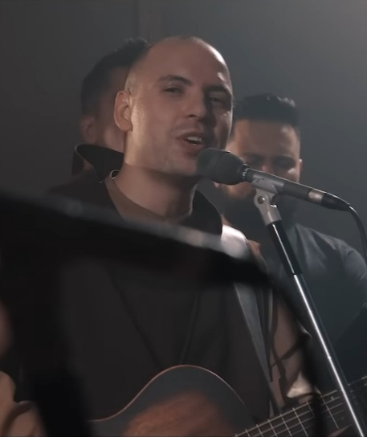

# Imagens Sugeridas para o Site - Cifras do Frei Gilson

## Imagens Necessárias

### 1. Galeria do Frei Gilson (2 imagens adicionais)
**Localização**: Seção "Sobre o Frei Gilson" - galeria pequena
**Tamanho**: 100px altura, responsivo
**Sugestões**:
- Frei Gilson tocando violão
- Frei Gilson em momento de oração/meditação
- Frei Gilson com instrumentos musicais

### 2. Avatares para Depoimentos (8 imagens)
**Localização**: Seção de depoimentos
**Tamanho**: 60px x 60px (grandes), 40px x 40px (pequenos)
**Sugestões**:
- Fotos genéricas de pessoas (homens e mulheres)
- Avatars ilustrados
- Ícones de usuários diversos

## Fontes de Imagens Gratuitas Recomendadas

### Unsplash (unsplash.com)
- **Violão/Guitarra**: https://unsplash.com/s/photos/acoustic-guitar
- **Música Católica**: https://unsplash.com/s/photos/church-music
- **Instrumentos**: https://unsplash.com/s/photos/musical-instruments
- **Pessoas**: https://unsplash.com/s/photos/people-portrait

### Pixabay (pixabay.com)
- **Música Católica**: https://pixabay.com/pt/images/search/musica%20catolica/
- **Violão**: https://pixabay.com/pt/images/search/violao/
- **Igreja**: https://pixabay.com/pt/images/search/igreja/
- **Avatares**: https://pixabay.com/pt/images/search/avatar/

### Pexels (pexels.com)
- **Música**: https://www.pexels.com/search/music/
- **Violão**: https://www.pexels.com/search/guitar/
- **Retratos**: https://www.pexels.com/search/portrait/

## URLs Específicas de Imagens Sugeridas

### Para a Galeria do Frei Gilson:
1. **Violão em close**: 
   - Unsplash: https://unsplash.com/photos/brown-acoustic-guitar-beside-white-and-black-piano-tiles-nBJHO6wmRWw
   - Alternativa: https://unsplash.com/photos/person-playing-guitar-1rBg5YSi00c

2. **Mãos tocando violão**:
   - Unsplash: https://unsplash.com/photos/person-playing-brown-guitar-ZVprbBmT8QA
   - Alternativa: https://unsplash.com/photos/person-holding-guitar-neck-4Hg8LH9Hoxc

### Para Avatares de Depoimentos:
1. **Maria Silva (MS)**: https://unsplash.com/photos/woman-wearing-black-scoop-neck-long-sleeved-shirt-rDEOVtE7vOs
2. **João Santos (JS)**: https://unsplash.com/photos/man-in-white-dress-shirt-and-black-blazer-WNoLnJo7tS8
3. **Ana Paula (AP)**: https://unsplash.com/photos/woman-smiling-wearing-denim-jacket-hasaFqhbmVM
4. **Roberto Mendes (RM)**: https://unsplash.com/photos/man-wearing-white-top-in-front-of-woman-wearing-blue-long-sleeved-shirt-Zz5LQe-VSMY

## Como Implementar

### 1. Download das Imagens
```bash
# Criar pasta para imagens temporárias
mkdir temp_images

# Baixar imagens usando curl ou wget
curl -o temp_images/guitar1.jpg "URL_DA_IMAGEM"
```

### 2. Otimização
- Redimensionar para os tamanhos corretos
- Comprimir para web (qualidade 80-85%)
- Converter para formatos otimizados (WebP quando possível)

### 3. Organização
```
assets/
├── Frei_Gilson.jpg (já existe)
├── gallery/
│   ├── guitar-moment.jpg
│   └── presentation.jpg
└── avatars/
    ├── maria-silva.jpg
    ├── joao-santos.jpg
    ├── ana-paula.jpg
    └── roberto-mendes.jpg
```

## Código para Implementar

### Galeria (index.html)
```html
<div class="image-gallery">
    <div class="gallery-item">
        
    </div>
    <div class="gallery-item">
        
    </div>
    <div class="gallery-item">
        
    </div>
</div>
```

### Avatares (index.html)
```html
<div class="author-image">
    
</div>
```

### CSS para Avatares
```css
.avatar {
    width: 60px;
    height: 60px;
    border-radius: 50%;
    object-fit: cover;
}

.avatar.small {
    width: 40px;
    height: 40px;
}
```

## Licenças e Atribuições

### Unsplash
- Licença: Gratuita para uso comercial
- Atribuição: Não obrigatória, mas recomendada
- Formato: "Foto por [Nome] no Unsplash"

### Pixabay
- Licença: Pixabay License (gratuita)
- Atribuição: Não obrigatória
- Uso comercial: Permitido

### Pexels
- Licença: Pexels License (gratuita)
- Atribuição: Não obrigatória
- Uso comercial: Permitido

## Próximos Passos

1. Escolher e baixar as imagens das URLs sugeridas
2. Otimizar e redimensionar conforme necessário
3. Organizar na estrutura de pastas proposta
4. Atualizar o HTML para usar as imagens reais
5. Testar a responsividade em diferentes dispositivos
6. Adicionar atribuições se desejado (footer ou página sobre)